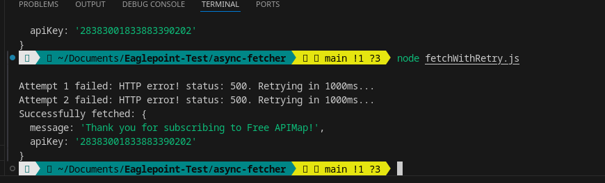

# Async Data Fetcher with Retry

This JavaScript project shows an **asynchronous data fetcher** that retries on failure.

It includes two files:

1. `mockApi.js` – A mock API server that sometimes fails randomly.
2. `fetchWithRetry.js` – The fetcher that retries on failure with a delay.


## Features

- **Fetch data from a URL** using `async/await`.  
- **Retry on failure** up to a configurable number of attempts.  
- **Delay between retries** (default 1 second).  
- **Throws error** if all retries fail.  
- **Simulated API** to test retry logic.  

## How It Works

1. **Mock API (`mockApi.js`)**  
   - Uses Express to simulate a server.  
   - Randomly fails 50% of the time to mimic unstable APIs.  
   - Returns data on success:

2. **Fetcher (`fetchWithRetry.js`)**  
   - Uses a `while` loop with `try/catch` to handle retries.  
   - Waits 1 second between attempts using `setTimeout` wrapped in a Promise.  
   - Logs each attempt for transparency.  
   - Throws a detailed error if all retries fail.


## Installation

Make sure you have **Node.js 21+** installed.

Install dependencies for the mock API:

```bash
npm install express
```
## Usage

Step 1: Start the Mock API
```bash
node mockApi.js
```

The server will run at http://localhost:3000/data.

Step 2: Run the Fetcher
```bash
node fetchWithRetry.js
```

## Result

