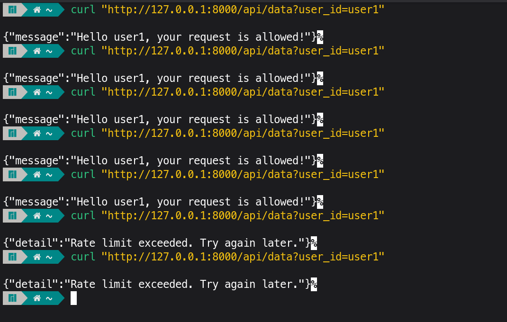
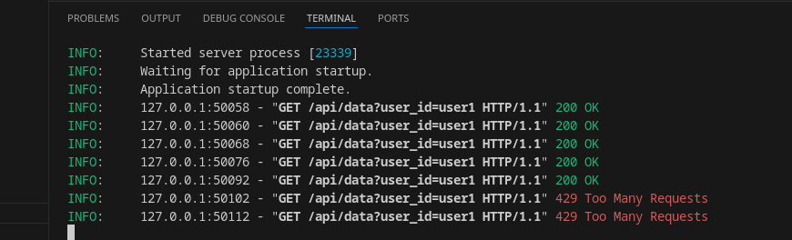

# FastAPI Sliding Window Log Rate Limiter

This shows an **efficient rate limiter** using the **Sliding Window Log algorithm**.  
It limits requests per user and automatically resets after a defined time window.

## Features

- **Limit requests per user**: Configurable limit (default 5 requests per 60 seconds).  
- **Sliding Window Log**: Tracks request timestamps for precise rate limiting.  
- **Automatic reset**: Old requests are removed naturally after the window.  
- **Blocks excess requests**: Returns HTTP 429 when limit exceeded.  
- **Per-user tracking** using `user_id`.  

## How It Works

1. **Sliding Window Log**  
   - Each user has a `deque` storing timestamps of their recent requests.  
   - When a request comes in, timestamps older than the window are removed.  
   - If the number of timestamps is below the limit, the request is allowed; otherwise, it’s blocked.

2. **Data Structure**  
   - `user_requests: Dict[str, deque]` maps user IDs to their request history.  
   - `deque` is used because popping old timestamps from the left is **O(1)**, making it efficient.

3. **Auto-reset**  
   - No additional timers are needed; old timestamps are discarded naturally when checking the window.


## Installation

Make sure you have Python 3.9+ installed.

Install FastAPI and uvicorn:

```bash
pip install fastapi uvicorn
```
## Usage

Save the code as main.py and start the server:
```bash
uvicorn main:app --reload
```
### Example Request
```bash
curl "http://127.0.0.1:8000/api/data?user_id=user1"
```

## Result



